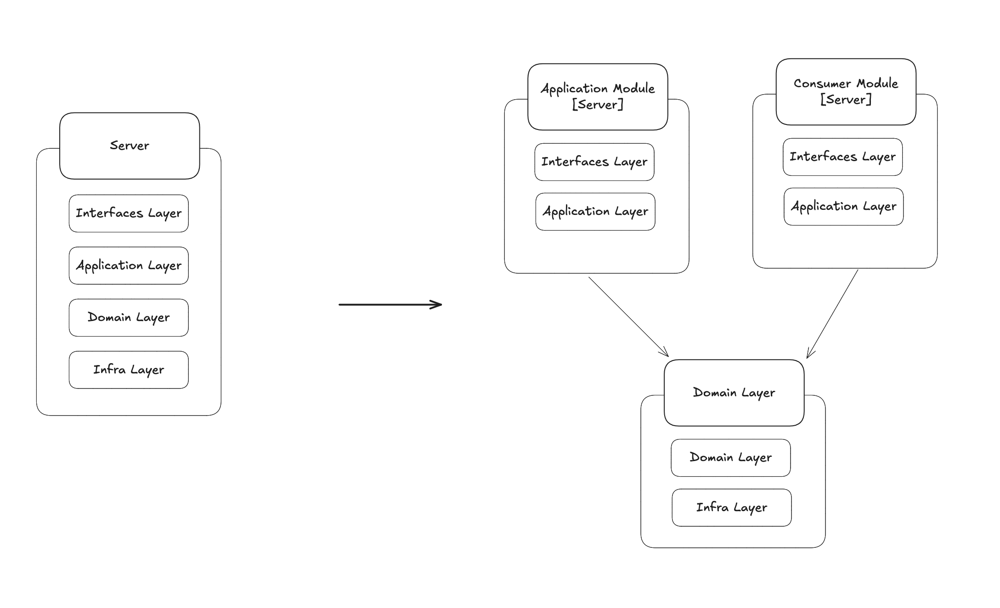
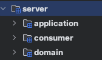
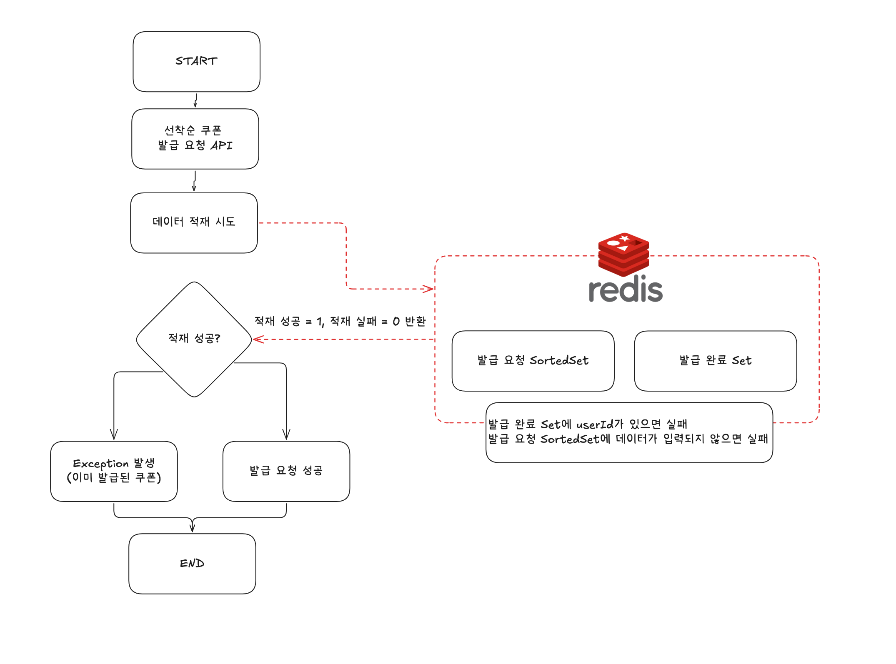
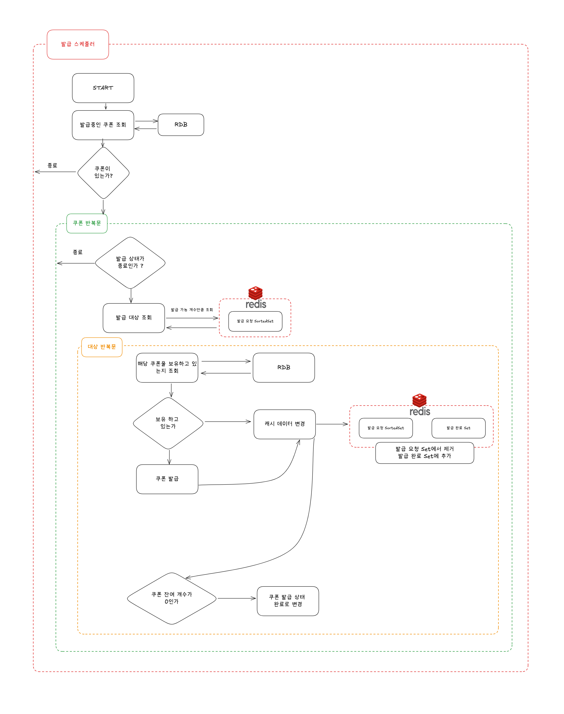
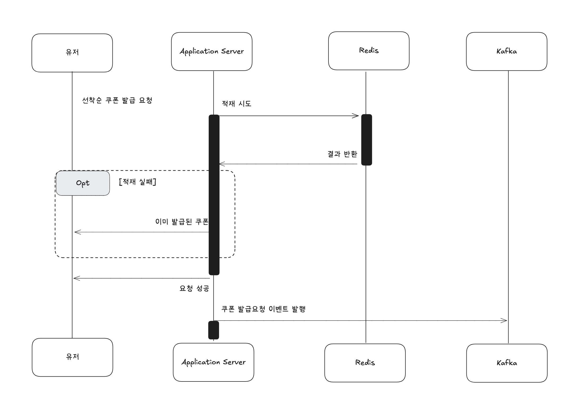
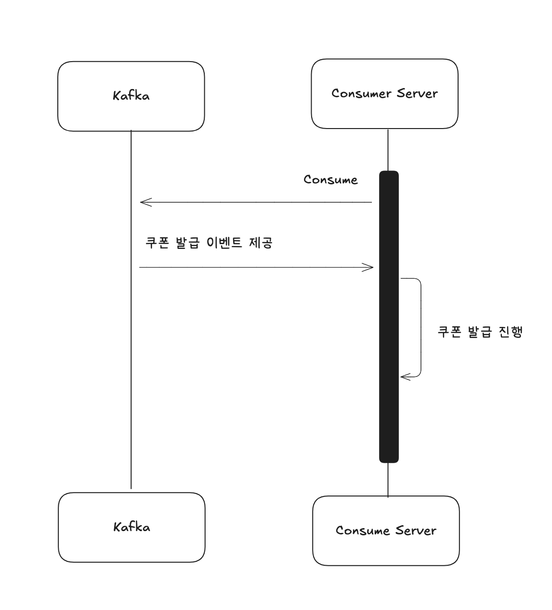

# 선착순 쿠폰 Kafka 적용 및 모듈 분리

현재 선착순 쿠폰은 Redis로 발급 요청을 받아 Scheduler가 해당 요청을 읽어 쿠폰을 발급하고 있다.

해당 로직에 Kafka를 적용한 로직으로 변경하고자 한다.

그 전에, 현재 모놀리틱 아키텍처 구조에서의 Kafka 적용은 다소 오버엔지니어링에 가깝다.

같은 어플리케이션에서 이벤트를 전파하기 위해선 ApplicationEventPublisher를 사용하면 되는데, Kafka를 통해 외부로 Event를 전송하는 자체가 문제 되기도 하며, Kafka의 매력을 느끼지 못할 것이 분명하다.(코치님의 강력한 어필)

그로써 현재 프로젝트를 멀티 모듈로 변경하여 2대의 서버에서 Kafka를 통한 통신을 하게끔 구현해보고자 한다.

## 모듈 분리

분리된 모듈의 형태는 다음과 같다.

Appilication Module
 - 기존의 서버로 API 요청을 처리한다.

Consumer Module
 - Kafka의 이벤트를 consume하여 처리하는 Consumer Server이다.

Domain Module
 - 각 Application 및 Consumer Module은 해당 모듈을 주입받아 사용하게 된다.

해당 모듈로 분리하기 위해선, 현재 가지고 있는 서버의 소스와 테스트 코드들을 새로운 모듈로 옮겨야 하며, 당연하게도 모든 테스트코드가 통과해야한다.

모듈 분리 작업을 하며 마주한 이슈들을 짤막하게 소개하자면,

1. Custom Exception이 HttpStatus를 반환한다.
    - 해당 Exception은 Domain Module에서 사용하는 Exception인데, 사실 이 Domain Module은 HTTP 요청에만 국한되는 것이 아닌 현재 상황처럼 Consumer Server에서도 사용되는 Exception이므로 HttpStatus를 반환하는 로직을 제거하였다.
2. SpringBootApplication이 없는 Domain Module에서의 테스트
    - test 패키지에 해당 어노테이션을 붙인 클래스를 하나 생성해서 해결하였다.
3. Application, Consumer Module에서 Domain Module의 Bean을 찾을 수 없음.
    - ComponentScan을 통해 해결
        - 해당 어노테이션을 Application 클래스에 붙일 시 Controller 테스트들이 모두 실패함
            - 새로운 Config 객체를 만들어서 해결

이외에도 자잘자잘하게 많은 오류들을 마주했고, 다양한 개념들을 다시 익히는 시간이 되었다. (포기할 뻔)

이로써 모든 테스트코드를 통과하는 3개의 모듈로 분리를 성공하였다.

자 이제 쿠폰 로직을 변경해보도록 하자.

## Kafka를 적용한 선착순 쿠폰 발급

변경 전 쿠폰 발급 요청과 발급 로직은 다음과 같다.

### [변경 전] 쿠폰 발급 요청 로직

### [변경 전] 쿠폰 발급 로직

edis를 통해서 발급되고 있는데, 레디스 데이터를 읽고 저장하는 과정에서 lua script를 사용하는 등 굉장히 복잡하게 구성되어 있다.

이를 Kafka를 통해서 아래와 같이 변경하였다.

### [변경 전] 쿠폰 발급 요청 로직

### [변경 후] 쿠폰 발급 로직

불필요한 반복문, 스케줄러를 모두 없애고 발급 요청은 Redis를 통해 중복을 제거한 데이터만을 Kafka 이벤트로 발행,

Kafka 이벤트를 consume하는 Consumer Server는 이벤트를 받아 단건으로 쿠폰 발급을 진행한다.

이로써 모듈 분리와 선착순 쿠폰 발급 API를 Kafka를 적용하여 모두 완료하였다.

멀티 모듈에 대해 조금은 알아가는 시간이 되었던 것 같고, 관심사 분리가 무엇인지 다시 한번 깨닫는 주차가 되었다.