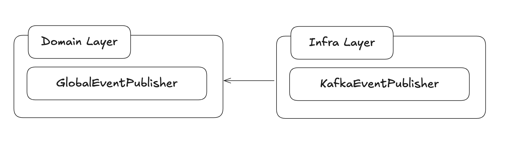

해당 보고서에서는 Kafka에 대한 기본적인 지식에 대한 정리 및 현재 프로젝트에서 주문 완료 시 Event를 발행하여 외부 플랫폼으로 전송하는 로직을 Kafka에 publish하는 것으로 변경하는 내용을 포함하고 있습니다.

1. [Kafka 정리](#Kafka-정리)
2. [주문 데이터 외부 플랫폼 전송 Kafka 활용](#주문-데이터-외부-플랫폼-전송-Kafka-활용)

# Kafka 정리

## Broker

메시지를 저장, 관리하고 Producer와 Consumer 간에 데이터를 중계하는 서버 프로세스

Producer의 메시지를 받아 offset 지정 후 디크스에 저장

Consumer의 파티션 Read에 응답해 디스크의 메시지 전송

### 주요 역할

**토픽 관리**

- Topic 생성, 삭제, 파티션(Partition) 관리

**스토리지**

- 각 파티션에 쌓이는 메시지를 디스크에 로그(log) 형태로 순차 저장

**리더/팔로워 복제**

- 고가용성(HA)를 위해 파티션 리더와 복제(팔로워) 노드 간 복제 관리

**메타데이터 제공**

- 클러스터 구성, 파티션 리더 위치, ISR(In-Sync Replicas) 상태 등을 Producer/Consumer에 제공

하나의 Kafka 클러스터는 여러 대의 Broker로 구성할 수 있으며, 각 Broker는 기본적으로 server.properties에서 설정된 포트(기본 9092)로 클라이언트 통신을 처리합니다.

- Cluster 내에서 각 1개씩 존재하는 Role Broker
    - Controller

      다른 브로커를 모니터링하고 장애가 발생한 Broker에 특정 토픽의 Leader 파티션이 존재한다면, 다른 브로커의 파티션 중 Leader를 재분배하는 역할을 수행

    - Coordinator

      컨슈머 그룹을 모니터링하고 해당 그룹 내의 특정 컨슈머가 장애가 발생해 매칭된 파티션의 메시지를 Consume할 수 없는 경우, 해당 파티션을 다른 컨슈머에게 매칭해주는 역할 수행

      (Rebalance)


## Producer

메시지를 카프카 브로커에 적재(발행)하는 서비스

### 주요 기능

- **토픽 지정**

  메시지를 보낼 대상 토픽과 파티션 선택

- 파티셔닝 전략
    - 키 기반 : 메시지 key를 해시해 특정 파티션에 라우팅
    - 라운드 로빈 : 키가 없을 때 순차 할당
    - 커스텀 : 사용자가 직접 구현 가능
- 전송 보장(ACK) 레벨
    - acks=0 : Producer가 브로커 ACK를 기다리지 않음
    - acks=1 : 리더 파티션에 메시지 기록 후 ACK
    - acks=all : 모든 ISR에 복제 완료 후 ACK (최대 내구성)

## Consumer

Kafka 토픽에서 메시지를 구독(subscribe) 및 소비(consume)하는 클라이언트 라이브러리

### 주요 기능

- **토픽/파티션 구독 : 하나 이상의 토픽을 지정해 데이터를 가져옴**
- Consumer Group : 같은 그룹으로 묶인 Consumer들은 파티션을 서로 분배 받아 읽고, 그룹 내 offset(읽은 위치)를 공유
    - 각 파티션은 그룹 내에서 오직 하나의 Consumer가 읽음 → 수평 확장 가능
- Offset 관리
    - 자동 커밋(enable.auto.commit=true) : 주기적으로 브로커에 가장 최신의 읽은 offset 저장
    - 수동 커밋 : 애플리케이션 로직이 완료된 시점에 직접 커밋
- Rebalance : Consumer 추가/삭제 시 파티션 할당 재조정

## Topic

Kafka에서 메시지를 논리적으로 분류하는 단위

RDB의 테이블, 메시지 큐의 큐와 유사한 개념

### 특징

- 여러 Producer가 같은 Topic에 데이터를 발행(publish)할 수 있고, 여러 Consumer가 구독(subscribe)해 소비할 수 있다.
- Topic별로 보존(retention) 설정, 압축(compression) 설정, 메시지 포멧(schema) 등을 독립적으로 관리할 수 있다.

## Partition

Topic을 물리적으로 분할한 단위, 메시지는 해당 Partition의 로그(log)에 순차적으로 쌓인다.

### 주요 역할

- 확장성(Scalability) : 하나의 topic을 여러 partition으로 나누면, 서로 다른 Broker에 분산 배치되어 메시지 처리량을 높일 수 있다.
- 병렬 처리(Parallelism) : Consumer Group 내에서 각 Partition은 최대 한 Consumer에게만 할당되므로, 여러 Consumer가 동시에 병렬로 메시지를 처리할 수 있다.
- Partitioner
    - 메세지를 발행할 때, 토픽의 어떤 파티션에 저장될 지 결정하며 Producer 측에서 결정. 특정  메세지에 키가 존재한다면 키의 해시 값에 매칭되는 파티션에 데이터를 전송함으로써 키가 같은 메시지를 다건 발행하더라도, 항상 같은 파티션에 메세지를 적재해 **처리순서를 보장**할 수 있음.

전체 메시지의 발행 순서처리를 보장하지 않지만, 같은 파티션의 메시지에 대해서는 순차처리를 보장

동시성 제어의 개념을 생각했을 때, 동시에 처리되면 안되는 자원의 id 등을 메시지의 key로 설정하면 순차처리가 보장되어야 하는 케이스는 보장도 되면서 병렬 처리로 높은 처리량을 보장한 하이브리드

## Rebalancing

Consumer Group의 가용성과 확장성을 확보해주는 개념

특정 컨슈머로부터 다른 컨슈머로 파티션의 소유권을 이전시키는 행위

**Rebalancing 중에는 컨슈머가 메시지를 읽을 수 없다.**

Rebalancing case

1. Consumer Group 내에 새로운 Consumer 추가
2. Consumer Group 내에 특정 Consumer 장애로 소비 중단
3. Topic 내에 새로운 Partition 추가

# 주문 데이터 외부 플랫폼 전송 Kafka 활용

### Library

| 라이브러리 | 특징 |
| --- | --- |
| **kafka-clients** | 가장 기본, 직접 Producer/Consumer 제어 |
| **spring-kafka** | Spring 스타일 템플릿·리스너 지원, 가장 널리 쓰임 |
| **spring-cloud-stream-binder-kafka** | 선언적 바인딩, 마이크로서비스 간 이벤트 파이프라인 손쉽게 구성 |
| **reactor-kafka** | 리액티브 스트림, 높은 동시성·비동기 처리 |
| **spring-kafka-streams** | Kafka Streams용 Spring 추상화 (추가 의존성: `spring-kafka-streams`) |

라이브러리 종류는 위와 같으며, spring-kafka를 보편적으로 사용하고, 관련 자료들도 대중적으로 많이 알려져있기 때문에 해당 라이브러리를 사용하고자한다.

```
implementation("org.springframework.kafka:spring-kafka")
```

```
  kafka:
    bootstrap-servers: localhost:9092
    consumer:
      group-id: my-group
      auto-offset-reset: earliest
      key-deserializer: org.apache.kafka.common.serialization.StringDeserializer
      value-deserializer: org.apache.kafka.common.serialization.StringDeserializer
    producer:
      key-serializer: org.apache.kafka.common.serialization.StringSerializer
      value-serializer: org.apache.kafka.common.serialization.StringSerializer
```

Domin Layer는 실질 구현체를 몰라야하기 대문에, GlobalEventPublisher라는 Interface로 사용하고,

Infra Layer에서 해당 interface를 Kafka구현체로 구현하여 사용하였습니다.


```java
@Component
@RequiredArgsConstructor
public class OrderEventListener {

    private final GlobalEventPublisher globalEventPublisher;

    @TransactionalEventListener(phase = TransactionPhase.AFTER_COMMIT)
    @Async
    public void handleOrderCompleted(OrderCompletedEvent event) {
        globalEventPublisher.publish("outside.order.completed.v1", event.orderInfo());
    }

}
```

이로써 별도의 쓰레드 (비동기)에서 globalEvent를 발행하여 외부 플랫폼에서 해당 이벤트를 받아 처리할 수 있게 구현하였습니다.