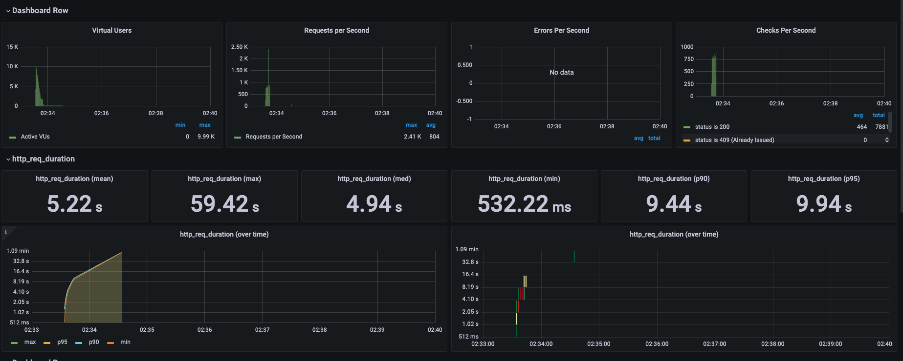

# 부하 테스트
### 부하테스트 대상

가장 트래픽이 많을 것으로 예상되는 선착순 쿠폰 API를 부하테스트 대상으로 가져가도록 한다.

이를 통해 병목현상이 발생하는지 확인하고, 결과 TPS를 통해 추후 운영상황에서 처리량을 가늠할 수 있습니다.

### 시나리오 구성

10,000명의 사용자가 동시에 쿠폰 발급 요청한다.

### 테스트 방법

K6를 통해 테스트를 진행하고, Grafana를 연동해 시각적 데이터를 확보합니다.

```jsx
const COUPON_ID = '1';

export let options = {
    scenarios: {
        peak_10000: {
            executor: 'per-vu-iterations',
            vus: 10000,       // 10,000명의 가상 사용자
            iterations: 1,    // 각 VU당 1회 요청
            startTime: '0s',  // 시작 지연 없이 바로 실행
        },
    },
};

// 사용자 ID 범위 (가상 사용자의 ID를 생성하는 함수)
function generateUserId() {
    return Math.floor(Math.random() * 10000) + 1;
}

export default function () {

    const userId = __VU;

    const headers = {
        'Content-Type': 'application/json',
        'X-USER-ID': userId,
    };

    const url = `http://localhost:8080/api/v1/coupons/call/${COUPON_ID}`;

    const response = http.post(url, null, { headers });

    check(response, {
        'status is 200': (r) => r.status === 200,
        'status is 409 (Already Issued)': (r) => r.status === 409,
        'status is 500': (r) => r.status === 500,
    });

    sleep(0.1);
}
```

선착순 쿠폰 발급 요청 특성상 사용자는 다수의 요청을 진행하는 것이 아닌, 1회만 진행하여 보다 운영상 가까운 데이터를 확보할 수 있도록 세팅하였습니다.

```
  grafana:
    image: grafana/grafana:9.3.8
    networks:
      - grafana
    ports:
      - "3000:3000"
    environment:
      - GF_AUTH_ANONYMOUS_ORG_ROLE=Admin
      - GF_AUTH_ANONYMOUS_ENABLED=true
      - GF_AUTH_BASIC_ENABLED=false
    volumes:
      - ./grafana:/etc/grafana/provisioning/

  k6:
    image: grafana/k6:latest
    networks:
      - k6
    ports:
      - "6565:6565"
    environment:
      - K6_OUT=influxdb=http://influxdb:8086/k6
    volumes:
      - ./k6:/scripts

  influxdb:
    image: influxdb:1.8
    networks:
      - k6
      - grafana
    ports:
      - "8086:8086"
    environment:
      - INFLUXDB_DB=k6
```

docker-compose를 통해 해당 테스트를 grafana에 연동할 수 있도록 세팅하였습니다.

### 결과 및 대응

```
✗ status is 200
  ↳  81% — ✓ 8192 / ✗ 1808
✗ status is 409 (Already Issued)
  ↳  0% — ✓ 0 / ✗ 10000
✗ status is 500
  ↳  0% — ✓ 0 / ✗ 10000

HTTP
http_req_duration.......................................................: avg=5.22s min=0s       med=4.94s max=59.42s p(90)=9.45s  p(95)=9.94s
  { expected_response:true }............................................: avg=5.65s min=532.21ms med=5.35s max=10.29s p(90)=9.52s  p(95)=9.94s
http_req_failed.........................................................: 18.07% 1808 out of 10000
http_reqs...............................................................: 10000  163.517403/s

EXECUTION
iteration_duration......................................................: avg=8.35s min=1.01s    med=6.85s max=1m0s   p(90)=16.12s p(95)=16.31s
iterations..............................................................: 10000  163.517403/s
vus.....................................................................: 100    min=0             max=9988
vus_max.................................................................: 10000  min=518           max=10000

```

이러한 결과 값이 나왔는데, 우선 중요하게 봐야할 부분은 성공 비율이 81%인 것과, http_reqs의 163.5s 즉, 평균 TPS 값입니다.

우선 별도로 409 (이미 발급 요청한 쿠폰입니다)와 500은 없지만, 테스트 중 timeout이 발생하고 있습니다.

```
WARN[0087] Request Failed error="Post \"http://localhost:8080/api/v1/coupons/call/1\": request timeout"

```

또한, 현재 평균 TPS가 163으로 나오고 있는데, 이는 grafana의 시각화 통계를 통해 좀 더 자세한 결과를 확인할 수 있었습니다.



주요하게 봐야하는 데이터는 우선 VirtualUsers가 일정한 수준으로 감소되다가 100건의 User가 장시간 잔류하는 현상이 발생되었습니다.

또한, RPS는 평균적으로 800정도 처리량을 보여주고 있으며, 100건의 User가 장시간 잔류하여 평균 TPS가 높아진 것으로 예상됩니다.

요청된 건은 10,000건이고, RPS는 800으로 유지되는 것으로 보아 요청 API쪽의 Scale out을 하여 RPS를 높여 timeout되는 현상을 줄여야 합니다.