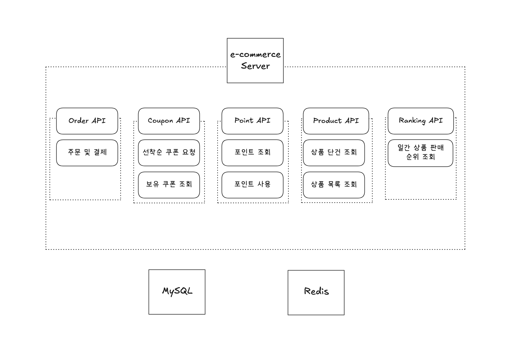
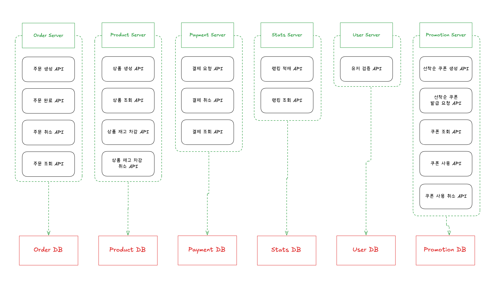

### MSA의 형태로 도메인 배포 방식 변경

현재 서버 구조도는 다음과 같다.

각 엔드포인트별로 제공되는 API를 표시하였으며, 모든 데이터는 1개의 Database와 특정 상황에서 Redis를 활용하는 방식으로 구현되어 있다.

이같이 전체 애플리케이션이 하나의 단일한 프로그램으로 구성된 형태의 아키텍처를 monolithic 아키텍처라고 한다. 해당 아키텍처는 선착순 쿠폰 요청이나 주문쪽에서 트래픽이 급증하여 스케일이 필요한 경우 앱 전체에 대한 스케일을 해야하며, 프로젝트 규모가 커졌을 때 특정 기능에 대한 배포도 앱 전체를 한 번에 빌드 및 배포해야 한다는 단점이 발생한다.

이에 따라서 MSA로 해당 서버를 재구성한다면 도메인 구성을 어떻게 가져갈지, 그로 인한 문제점은 무엇이고 해결 방안은 무엇인지 서술해보도록 하겠다.

각 도메인 별로 서버를 구성하고, 그에 맞는 Database를 구성하였다.

이때의 이점은, 각 도메인별로 독립적인 빌드, 배포가 가능하며, 스케일이 필요한 서버만 특정하여 진행할 수 있다.

하지만, 모놀리식에서 MSA로 변경됨에 따라 문제점이 발생되는데, 아래 ‘주문 결제’ 로직을 살펴보자.

1. 주문 서버에 해당 주문 상태 확인(PENDING)
2. 결제 API 호출
3. 재고 차감 API 호출
4. 쿠폰 사용 시 쿠폰 사용 API 호출
5. 주문 완료 API 호출

위와 같이 4개의 서버가 서로 통신하며 ‘주문 결제’ 로직을 수행하게 될 것이다.

해피 케이스의 경우 모든 로직이 정상 수행되었다면 문제가 없지만, 만일 3번 로직에서 실패하거나, 4번 로직에서 실패하게 되면 2번(결제 API)을 롤백해주어야 하는데, 현재 분산된 트랜잭션에 의해 별도의 처리가 필요하다.

### 분산 트랜잭션 관리

분산 트랜잭션을 관리하는 패턴은 대표적으로 3가지가 있다고 한다.

- 2PC
- SAGA
- TCC

2PC와 SAGA에 대한 정리로 해당 보고서를 마치도록 하겠다.

### 2PC

분산 트랜잭션 환경에서 **모든 참여 노드가 동일하게 커밋 또는 롤백** 결정을 내리도록 조정하는 원자적 커밋(atomic commitment) 알고리즘

즉, Prepare 단계를 두어 조정자(Coordinator)가 해당 트랜잭션의 모든 참여자(Participant)에게 커밋을 수행할 준비가 되었는지 확인을 하고, 참여자 중 자신의 로컬 트랜잭션을 커밋할 수 있는 상태가 아닌 참여자가 한 명이라도 존재할 시 롤백, 아니면 커밋을 수행한다.

분산된 트랜잭션을 마치 단일 트랜잭션처럼 수행하게 되는 해당 패턴은 ACID를 보장하지만, 조정자가 장애가 발생하거나 특정 참여자가 느리거나 네트워크 지연이 발생하면 전체 트랜잭션이 해당 노드를 기다리며 블로킹되는 단점이 있습니다.

또한 각 서비스들의 결합도를 낮추는 초점인 MSA와 트랜잭션 강결합이 발생하는 2PC 패턴은 서로 지향점이 다르므로 MSA에선 Saga 패턴을 지향한다고 한다.

### SAGA

여러 서비스에 걸친 **로컬 트랜잭션(local transaction)** 들을 순차적으로 실행하고,

실패 시 **보상 트랜잭션(compensating transaction)** 으로 선행 작업을 롤백함으로써 최종적인 일관성을 유지

- **Choreography (이벤트 기반 분산 조정)**

  각 서비스가 자신의 작업을 수행한 뒤 이벤트를 발행하고, 후속 서비스가 그 이벤트를 구독하여 동작합니다.

    - **장점**: 중앙 코디네이터 불필요, SPOF(단일 장애점) 회피
    - **단점**: 서비스 수가 많아질수록 이벤트 흐름 추적·디버깅이 어려워짐
- **Orchestration (중앙 코디네이터 방식)**

  Saga 전용 **오케스트레이터**(예: Camunda, Temporal, 혹은 자체 서비스)가 단계별로 REST/gRPC 호출을 순차 제어합니다.

    - **장점**: 흐름이 중앙에서 관리되어 모니터링·디버깅 용이
    - **단점**: 오케스트레이터가 SPOF가 될 수 있고, 추가 컴포넌트 운영 부담

SPOF란 ?

Single Point of Failure의 약자로, **시스템 구성 요소 중 하나가 고장나면 전체 시스템이 중단되는 요소**

Orchestration 방식에서는 모든 로직을 알고있는 중앙 코디네이터가 존재해야 하며, 위에서 서술한 SPOF가 발생할 수도 있고, 강한 결합이 이루어지므로 MSA의 특성을 모두 살릴 수 없다는 생각이 듭니다.

Choreography 방식은 Kafka와 같은 이벤트 브로커를 활용하여 구성해주어야 하며, 이벤트 설계가 복잡해지고, 이벤트 끼리의 상호작용 중 다양한 오류를 야기할 수 있다고 한다.

그래도 되도록이면 Kafka를 도입하여 Choreography 방식의 아키텍처를 구성하는 것을 목표로 하고 싶다.