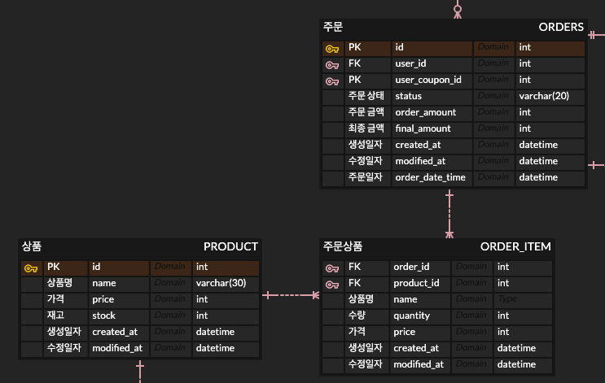
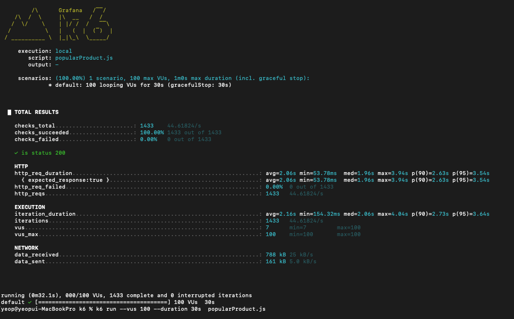
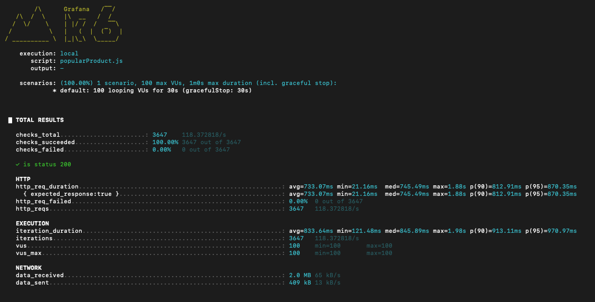

# 조회 성능 보고서

## 개요

해당 프로젝트는 아래와 같은 API를 제공한다.

- 잔액 충전 / 조회 API
- 상품 조회 API
- 주문 / 결제 API
- 선착순 쿠폰 API
- 인기 판매 상품 조회 API

이 중에서 조회 성능에 문제가 생길 만한 것들을 리스트업하고 해당 성능을 높이기 위한 전략을 세워보고자 한다.

## 성능 개선 대상 API

### 선착순 쿠폰 발급

쿠폰의 데이터베이스 구조는 아래와 같다.


쿠폰을 발급받을 시 coupon의 데이터를 기반으로 user_coupon의 데이터를 추가한다.

선착순 쿠폰 발급의 경우 아래의 실패 테스트 케이스를 가진다.

1. 발급 대상 쿠폰의 발급 가능 수량이 1이하인 경우 발급에 실패한다.
2. 발급 대상 유저가 발급 대상 쿠폰을 보유하고 있는 경우 발급에 실패한다.

2번째 케이스의 경우 해당 유저가 쿠폰을 보유하고 있는지 확인해야 하며, 아래의 쿼리가 실행된다.

```sql
SELECT 
    id, user_id, name, type, discount_type, discount_amount
    , expired_at, used_at, created_at, modified_at
FROM user_coupon
WHERE user_id = 23
    AND coupon_id = 98;
```

현재 아무런 인덱스가 세팅되어있지 않으며, 실행계획을 돌려보면 table full scan을 하는 것을 확인할 수 있다.

```sql
-> Filter: ((user_coupon.coupon_id = 98) and (user_coupon.user_id = 23))  (cost=10095 rows=996) (actual time=70.2..70.2 rows=0 loops=1)
-> Table scan on user_coupon  (cost=10095 rows=99588) (actual time=0.0719..61 rows=100000 loops=1)
```

이를 개선하기 위해 user_id에 인덱스를 설정할 수 있지만, coupon_id까지 복합 인덱스로 설정하면 커버링 인덱스를 만들 수 있기 때문에
상대적으로 카디널리티가 높은 user_id를 앞 순서로 인덱스를 구성하였고, 결과는 아래와 같다.

```sql
CREATE INDEX idx_user_coupon_user_coupon ON user_coupon(user_id, coupon_id);
```

```sql
-> Index lookup on user_coupon using user_id_coupon_id_idx (user_id = 23, coupon_id = 98)  (cost=0.35 rows=1) (actual time=0.024..0.024 rows=0 loops=1)
```

Filter 구문이 없어지고, index로만 조회가 가능한 상태가 되었다.

### 인기 상품 조회 API

3일간 가장 판매가 많이 된 상품 5개를 조회할 수 있는 API 이다.

해당 기능은 메인 페이지 최초 접속 시 API를 요청하며, 많은 트래픽이 발생할 수록 Database에 요청이 많아져 병목현상이 발생할 수 있다.

## 테이블 구조도



해당 기능은 위의 테이블을 참조하게 되며, 아래와 같은 쿼리로 조회를 할 수 있다.

```sql
SELECT op.product_id, SUM(op.quantity) AS total_quantity, p.name, p.price, p.stock
FROM order_product op
         JOIN orders o ON op.order_id = o.id
         JOIN product p ON op.product_id = p.id
WHERE o.status = 'SUCCESS'
  AND o.order_date_time >= DATE_SUB(CURDATE(), INTERVAL 3 DAY)
GROUP BY op.product_id, p.name, p.price, p.stock
ORDER BY total_quantity DESC LIMIT 5;
```

SQL로 유저 100명, 상품 1000개, 오더 10,000개를 넣어서 테스트를 진행했다.

(CommandLineRunner로 프로젝트에서 직접 넣어봤는데, orderDateTime을 now로 넣어주고 있어서 제대로 된 데이터 입력이 불가했다.)

모든 테이블은 PK만 있으며, 인덱스는 설정하지 않은 상태이며, 실행계획을 돌려보면 아래와 같은 결과를 받을 수 있다.


```sql
-> Limit: 5 row(s)  (actual time=32..32 rows=5 loops=1)
    -> Sort: total_quantity DESC, limit input to 5 row(s) per chunk  (actual time=32..32 rows=5 loops=1)
        -> Table scan on <temporary>  (actual time=31.7..31.8 rows=828 loops=1)
            -> Aggregate using temporary table  (actual time=31.7..31.7 rows=828 loops=1)
                -> Nested loop inner join  (cost=1698 rows=1008) (actual time=0.25..27.7 rows=1778 loops=1)
                    -> Nested loop inner join  (cost=1345 rows=1008) (actual time=0.241..22.1 rows=1778 loops=1)
                        -> Filter: ((o.order_date_time >= <cache>((curdate() - interval 3 day))) and (o.`status` = 'SUCCESS'))  (cost=992 rows=1008) (actual time=0.22..8.71 rows=1778 loops=1)
                            -> Table scan on o  (cost=992 rows=9678) (actual time=0.21..5.66 rows=10000 loops=1)
                        -> Filter: (op.product_id is not null)  (cost=0.25 rows=1) (actual time=0.00546..0.00649 rows=1 loops=1778)
                            -> Index lookup on op using order_id_idx (order_id = o.id)  (cost=0.25 rows=1) (actual time=0.00516..0.00609 rows=1 loops=1778)
                    -> Single-row index lookup on p using PRIMARY (id = op.product_id)  (cost=0.25 rows=1) (actual time=0.00275..0.00283 rows=1 loops=1778)
```

실행결과는 다음과 같다. 풀스캔이 발생하고 있는데, 이를 한 번 인덱스를 걸어서 테스트를 진행해보자.

인덱스는 order_product에 order_id, product_id를 걸어주었고,

orders에 order_date_time, status에 걸어두었다.

```sql
-> Limit: 5 row(s)  (actual time=0.0426..0.0426 rows=0 loops=1)
    -> Sort: sum DESC, limit input to 5 row(s) per chunk  (actual time=0.0421..0.0421 rows=0 loops=1)
        -> Table scan on <temporary>  (actual time=0.0329..0.0329 rows=0 loops=1)
            -> Aggregate using temporary table  (actual time=0.0316..0.0316 rows=0 loops=1)
                -> Nested loop inner join  (cost=1.39 rows=0.333) (actual time=0.0217..0.0217 rows=0 loops=1)
                    -> Nested loop inner join  (cost=1.28 rows=0.333) (actual time=0.0212..0.0212 rows=0 loops=1)
                        -> Filter: ((o.order_date_time >= <cache>((curdate() - interval 3 day))) and (o.`status` = 'SUCCESS'))  (cost=1.16 rows=0.333) (actual time=0.0206..0.0206 rows=0 loops=1)
                            -> Covering index range scan on o using order_date_time_status_idx over ('2025-04-18 00:00:00.000000' <= order_date_time AND 'SUCCESS' <= status)  (cost=1.16 rows=1) (actual time=0.0198..0.0198 rows=0 loops=1)
                        -> Filter: (op.product_id is not null)  (cost=0.55 rows=1) (never executed)
                            -> Index lookup on op using order_id_idx (order_id = o.id)  (cost=0.55 rows=1) (never executed)
                    -> Single-row index lookup on p using PRIMARY (id = op.product_id)  (cost=0.55 rows=1) (never executed)

```

효과는 굉장했다 !

하지만 데이터의 문제인지 order_id와 order_date_time에 걸었을 때에는 효과가 컸지만, 이외의 인덱스는 효과가 그렇게 크지 않았다.

아무래도 product_id보다 order_id가 카디널리티가 높기 때문인 것 같다.

직접 API를 콜 했을 때의 상황도 보고 싶었다.

코치님께서 살짝 언급해주시고, 이전 수강생들의 코드를 봤을 때 K6라는 키워드를 본 적이 있다.

해당 프로그램으로 성능 테스트를 진행해보자.

## 성능 테스트 (K6를 곁들인)

K6는 JS파일 기반으로 실행되는 툴이었다. 파일을 만들어보자

```javascript
export const options = {
    stages: [
        { duration: '10s', target: 50 },   // 0 → 50명까지 증가
        { duration: '20s', target: 100 },  // 유지
        { duration: '10s', target: 200 },  // 더 증가
        { duration: '10s', target: 0 },    // 감소 및 종료
    ],
};

export default function () {
    const res = http.get('http://localhost:8080/api/v1/stats/products/popular');
    check(res, {
        'is status 200': (r) => r.status === 200,
    });
    sleep(1); // 사용자당 1초 대기
}
```

되게 간단하다. 순차적으로 유저들이 증가했다가 감소하는 것까지 세팅이 가능한 것 같다. 결과를 한번 보자

뭐가 뭔지 몰라서 GPT에 물어보니 아래와 같은 데이터를 집중해서 보라고 했다.

| 항목                | 설명                  | 주의해야 할 기준                      |
|-------------------|---------------------|--------------------------------|
| http_req_duration | 응답 시간 (ms) 평균, 최소   | avg > 300ms이면 병목 가능성           |
| http_reqs         | 전체 요청 수             | 적으면 부하가 충분히 안 걸린 것             |
| vus               | 가상 유저 수             | 올릴수록 병목 쉽게 드러남                 |
| status was 200    | HTTP 성공률            | 실패율이 있다면 서버 문제 (예: 500, 503 등) |
| p(90) p(95)       | 상위 90%, 95% 응답 시간   | 사용자 대부분의 실제 체감 속도              |

자 이제 결과를 봐보자.





인덱스 적용 전과 인덱스 적용 후이다.

인덱스 적용 전의 complete 값이 후보다 2배 정도 낮은데 성능은 3배 정도 올라갔다.

물론 별도의 통계 테이블을 둔다면 더 좋은 성능을 낼 수 있겠지만, 이 것으로 마치는 것이 좋겠다.

(추후 과제로 토스 ,,)